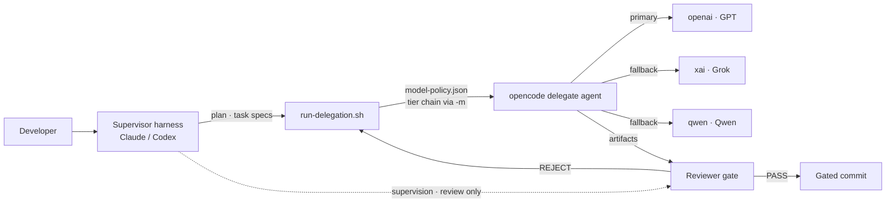
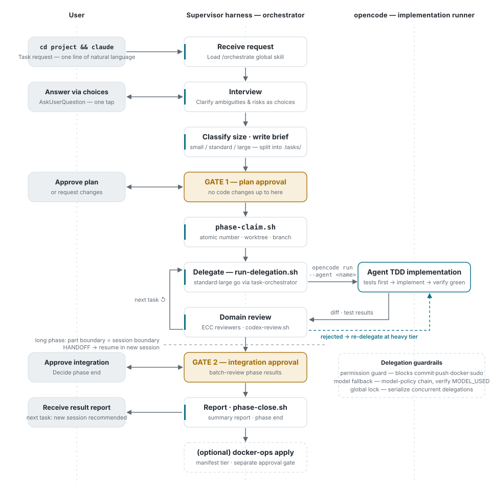

# dev-orchestrate-kit

**English** | [한국어](./README.ko.md)

> **Turn multiple AI subscriptions into one development pipeline.** A supervisor harness
> (Claude or Codex) does only planning and review; implementation is auto-delegated to
> opencode agents running on the subscriptions you already pay for (GPT, Grok, Qwen) —
> and when one subscription hits its limit, the chain falls back to the next quota pool.
> One script adopts it into any existing project.


A bootstrap kit that reproduces this development environment on any machine. It layers a
custom orchestration stack (onboarding command, model fallback chains, project scaffolding)
on top of [everything-claude-code](https://github.com/affaan-m/everything-claude-code) and
[superpowers](https://github.com/obra/superpowers).

## Why

**If Claude Code tokens feel expensive — stop burning Opus on mechanical implementation and
delegate it to the other subscriptions you already pay for.** The workflow this kit sets up
has three layers:

1. **Cross-subscription token optimization** — the supervisor (Claude) spends tokens only on
   planning, review, and approval gates; actual implementation is delegated through opencode
   to GPT / Grok / Qwen subscriptions. Different subscriptions are **separate quota pools**,
   so when one hits a limit the chain automatically falls back to the next provider and work
   never stalls.
2. **Automated project onboarding** — one `/orchestrate-onboard` run detects the real stack
   and generates the agent roster, delegation agents, reviewer mappings, and custom skills.
   Use `new-project.sh` for new projects or `adopt-project.sh` for existing ones —
   **non-destructive** (never overwrites existing files).
3. **A browser for headless servers** — a stealth CDP + escalating-fetch container for dev
   servers with no X display, GPU, or per-user Chrome. Usable **independently** of the
   orchestration workflow (see below).

## Prerequisites

- **One supervisor subscription** — either a **Claude plan** (Pro / Max) for Claude Code, or
  an **OpenAI plan** for Codex CLI. `--plan=pro|max5|max20` tunes token profiles to your
  Claude plan.
- **At least one delegation provider** — they are interchangeable; each one you add deepens
  the fallback pool:

  | Provider | What you need | Wire-up |
  |---|---|---|
  | OpenAI (GPT) | ChatGPT subscription | `opencode auth login -p openai` (OAuth) |
  | xAI (Grok) | subscription | `opencode auth login -p xai` (OAuth) |
  | Qwen / DeepSeek | API key | `QWEN_API_KEY` in `~/.config/opencode/secrets.env` |
  | Gemini (antigravity proxy) | API key + proxy | `ANTIGRAVITY_API_KEY` — the proxy (:8045) is not bundled; bring your own, see [PORTING](docs/PORTING.md) |

  A supervisor-side OpenAI subscription can double as a delegation provider — one
  subscription, two roles.
- **Tools** — bash 3.2+, git, python3, jq, and the [opencode](https://opencode.ai) CLI.
  Docker is only needed for the optional containers and the usage dashboard.

## Quick start

```bash
git clone https://github.com/fartypie-d/dev-orchestrate-kit.git
cd dev-orchestrate-kit

# Once per machine — installs global assets under $HOME; harness/provider choices are
# auto-detected or asked interactively if omitted (harness = supervisor-side Claude Code and/or Codex;
# opencode is always installed as the delegation executor)
./install.sh --claude --providers=qwen,openai --plan=max20 typescript python

# Per project — pick one of the two entry points to apply the kit to a project directory
./new-project.sh   ~/my-new-project      # starting fresh
./adopt-project.sh ~/existing-project    # already in progress (non-destructive)

# Then open the harness inside the project (with the smartest model) and run
/orchestrate-onboard
```

## How it works



- **The supervisor never implements.** Source changes go through `run-delegation.sh` to
  opencode and come back through a reviewer: ECC reviewer subagents under Claude,
  `codex-review.sh` under Codex.
- **Models are centrally governed.** `run-delegation.sh` injects the tier chain from
  `~/.config/opencode/model-policy.json` via `-m`, with automatic fallback on quota limits or
  hangs. Chains are generated by `gen-policy.sh` and live-verified by `model-doctor.sh`
  (so a typo'd model ID can't silently eat your fallbacks).
- **Parallel delegation is safe by construction.** With an `opencode serve` daemon
  (managed by `opencode-serve-ctl.sh`), delegations attach to the server and are locked
  **per project** — different projects run in parallel, the same project stays serial.
  Without a server it falls back to standalone mode under a global lock, because concurrent
  bare `opencode run` processes die silently on a session-DB conflict.
- **The project roster is the single source of truth.** `.claude/orchestrate.md` maps agents,
  reviewers, and verification commands; both harnesses share it. **No roster, no delegation.**

### Workflow in detail

One full phase cycle — the left lane is everything the user actually does (one instruction,
a few multiple-choice answers, two approvals). The full walkthrough with all five diagrams
lives in [docs/WORKFLOW.md](./docs/WORKFLOW.md) (Korean: [docs/WORKFLOW.ko.md](./docs/WORKFLOW.ko.md)).

<picture>
  <source media="(prefers-color-scheme: dark)" srcset="docs/assets/fig-flow-en-dark.svg">
  
</picture>

## Harness combinations

Both combinations use opencode as the implementation executor; the choice selects the
supervisor (orchestrator) harness.

| Combo | Install | Review | Enforced hooks |
|---|---|---|---|
| Claude + opencode | `./install.sh --claude` | ECC reviewer subagents | bash-guard · post-edit-check |
| Codex + opencode | `./install.sh --codex` | `scripts/codex-review.sh` | none — replaced by sandbox/approval |

## Layout

| Path | Contents |
|---|---|
| `install.sh` | Global install — harness/provider/container/plan selection, idempotent |
| `new-project.sh` / `adopt-project.sh` | The two entry points. Never overwrite existing files |
| `lib/stamp.sh` | Scaffolding functions shared by both entry scripts |
| `core/scripts/` | Harness-agnostic scripts — `run-delegation.sh`, `phase-tools.py`, … |
| `core/opencode/` | Provider mapping table, chain generator, `model-doctor.sh`, seed profiles |
| `core/onboard/` | `/orchestrate-onboard` procedure body (single source) |
| `core/project-template/` | Roster, agent conventions, docs system (harness-agnostic) |
| `adapters/claude/` | Global skills + project hooks, settings, CLAUDE.md, plan profiles |
| `adapters/codex/` | `~/.codex/prompts` + `.codex/` project layer, `codex-review.sh` |
| `containers/browser/` | Stealth CDP + escalating fetch API (git submodule → [insane-cloak](https://github.com/fartypie-d/insane-cloak)) |
| `components/usage-dashboard` | Session usage observability dashboard (git submodule) |

## usage-dashboard — session observability (submodule)

A local web dashboard that analyzes Claude Code + opencode session usage
([fartypie-d/usage-dashboard](https://github.com/fartypie-d/usage-dashboard)):
model mix and cost, cache efficiency, delegation chains, and session health. It reads the
`.orchestrate/events.jsonl` event log this kit emits to reconstruct the delegation tree
without log parsing.

The installer is the recommended setup path:

```bash
./install.sh --containers=dashboard    # or pick it in the installer wizard
# For browser + dashboard: ./install.sh --containers=browser,dashboard
# http://127.0.0.1:9280 (localhost only)
```

The installer initializes the `components/usage-dashboard` submodule, checks Docker,
Compose, and the port (default `9280`; set `INSTALL_DASH_PORT` to override the port
pre-check), then asks for confirmation before running `docker compose up -d`. If the
container fails to start, installation continues and the remaining manual steps include
a retry command for the failed container only.

If you want to start Docker later or are not using the installer, use the manual path:

```bash
git submodule update --init components/usage-dashboard
cd components/usage-dashboard
docker compose build && docker compose up -d
# http://127.0.0.1:9280 (localhost only)
```

Development happens in its own repository; this kit only bumps the submodule pointer at
release time.

## Standalone module — the browser container

The browser container lives in its own repository,
[insane-cloak](https://github.com/fartypie-d/insane-cloak), referenced here as the
`containers/browser` submodule. Even without the orchestration workflow it works on its own —
it exists for headless dev servers that need a browser but have no X display, GPU, or
per-user Chrome:

```bash
git submodule update --init containers/browser   # once, to fetch the submodule
cd containers/browser
bash insane-api/vendor/sync-vendor.sh    # vendor the upstream MIT engine at a pinned commit
docker compose up -d
# 127.0.0.1:9222 raw CDP · 127.0.0.1:9223 escalating fetch API
```

Need to see the screen? Add the noVNC overlay (`docker-compose.novnc.yml`, pinned to
127.0.0.1, view-only). Details and security notes: `containers/browser/README.md`.

### Using it over MCP

Point `chrome-devtools-mcp` at the container's CDP (`:9222`) and a harness like Claude Code
drives the browser directly. The MCP server does not spawn its own browser, so the stealth
fingerprint and the session are preserved.

```json
{
  "mcpServers": {
    "chrome-devtools": {
      "command": "npx",
      "args": ["-y", "chrome-devtools-mcp@latest", "--browserUrl", "http://127.0.0.1:9222"]
    }
  }
}
```

To isolate per caller, append `?fingerprint=<name>` to `--browserUrl`. Full details, including
security notes, are in the MCP section of `containers/browser/README.md`.

## Token profiles per Claude plan

`--plan=pro|max5|max20` assigns models to match your plan. Subagent tiering is done **only**
via the agent frontmatter `model:` field (`CLAUDE_CODE_SUBAGENT_MODEL` is forbidden — it
demotes reviewers too). **The quality gate (reviewers) stays on sonnet under every plan** —
savings come from the worker class and thinking budgets.

## Cross-machine sync convention

- **This repository is the single source.** Improve an orchestration asset on any machine →
  commit to the kit → push → pull on other machines and re-run `./install.sh` (idempotent).
- Don't hand-edit `~/.claude/skills/orchestrate` and call it done — the next install reverts it.
- **Exception — the browser container is a separate repository.** Fix the container on the dev
  host first, mirror it into [insane-cloak](https://github.com/fartypie-d/insane-cloak), then
  bump only the `containers/browser` submodule pointer here.
- **Exception — model-policy is generated.** The source of truth is the
  `core/opencode/provider-models.json` mapping table.
- Never included: secrets (`secrets.env`), subscription OAuth (per-machine login), memory and
  project data.

## Tests

```bash
python3 -m unittest discover -s tests -v
```

## Acknowledgements

This kit is assembled on top of the following open-source projects — all MIT licensed:

| Project | Role | License |
|---|---|---|
| [everything-claude-code](https://github.com/affaan-m/everything-claude-code) | Rules, agents, reviewer base layer | MIT |
| [superpowers](https://github.com/obra/superpowers) | Skills and workflows (brainstorming, TDD, SDD, …) | MIT |
| [opencode](https://opencode.ai) | Multi-provider delegation CLI | — |
| [insane-search](https://github.com/fivetaku/insane-search) | Escalating fetch engine (vendored into the browser container) | MIT |
| [CloakBrowser](https://github.com/CloakHQ/CloakBrowser) | Stealth Chromium (browser container base) | MIT |

Copyright and license notices for each project are preserved in the vendored tree
(`containers/browser/insane-api/vendor/LICENSE`) and in each installed repository.

## License

[MIT](./LICENSE) © fartypie-d
