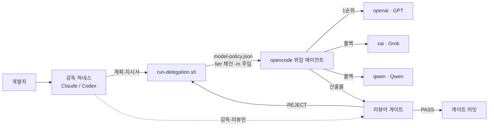

# dev-orchestrate-kit

> **여러 AI 구독을 하나의 개발 파이프라인으로.** 감독자(Claude 또는 Codex)는 계획·리뷰만 맡고,
> 구현은 이미 가진 다른 구독(GPT·Grok·Qwen)의 opencode 에이전트에 자동 위임한다 — 한 구독이
> 한도에 걸리면 다른 할당량 풀로 폴백한다. 기존 프로젝트에 스크립트 하나로 도입한다.


어떤 머신에든 이 개발환경을 재현하는 부트스트랩 키트다. ECC(everything-claude-code)·superpowers
위에 커스텀 오케스트레이션 계층(온보딩 명령, 모델 폴백 체인, 프로젝트 스캐폴드)을 얹는다.

## 왜 쓰는가

**Claude Code 토큰이 아깝다면 — 기계적인 구현에 Opus를 태우지 말고 이미 내고 있는 다른 구독으로
위임하라.** 이 키트가 세우는 워크플로우는 세 겹이다:

1. **구독 조합 토큰 최적화** — Claude(감독)는 계획·리뷰·게이트에만 토큰을 쓰고, 실제 구현은
   opencode 를 통해 GPT·Grok·Qwen 구독에 위임한다. 서로 다른 구독은 **별개 할당량 풀**이라,
   한쪽이 한도에 걸려도 체인의 다음 프로바이더로 자동 폴백해 작업이 멈추지 않는다.
2. **프로젝트 온보딩 자동화** — `/orchestrate-onboard` 한 번이면 스택을 실측 감지해 로스터·위임
   에이전트·리뷰어 매핑·커스텀 스킬까지 만든다. 신규는 `new-project.sh`, 기존 프로젝트는
   `adopt-project.sh` 로 **비파괴 도입**(기존 파일을 절대 덮지 않는다).
3. **헤드리스 서버용 브라우저** — 개발 서버에서 브라우저를 쓰기 어려운 환경을 위한 스텔스 CDP +
   우회 fetch 컨테이너. 오케스트레이션과 **독립적으로도** 쓸 수 있다 (아래 참조).

## 빠른 시작

```bash
git clone https://github.com/fartypie-d/dev-orchestrate-kit.git
cd dev-orchestrate-kit

# 전역 1회 — 하네스·프로바이더는 생략 시 자동 감지/대화형
./install.sh --claude --providers=qwen,openai --plan=max20 typescript python

# 프로젝트마다 — 둘 중 하나를 고른다
./new-project.sh   ~/my-new-project      # 새로 시작하는 프로젝트
./adopt-project.sh ~/existing-project    # 이미 작업 중인 프로젝트 (비파괴)

# 그다음 프로젝트에서 하네스를 열고 (가장 똑똑한 모델로)
/orchestrate-onboard
```

## 동작 개요



- **감독자는 구현하지 않는다** — 소스는 `run-delegation.sh` 로 opencode 에 위임하고 리뷰어로
  검수한다. Claude 는 ECC 리뷰어 서브에이전트, Codex 는 `codex-review.sh`.
- **모델은 중앙 정책** — `~/.config/opencode/model-policy.json` 의 tier 체인을 run-delegation.sh 가
  `-m` 으로 주입하고 한도·무응답 시 자동 폴백한다. 체인은 `gen-policy.sh` 가 생성하고
  `model-doctor.sh` 가 실측 검증한다 (오타 난 모델 ID 가 조용히 폴백만 소모하는 것을 막는다).
- **프로젝트 로스터** — `.claude/orchestrate.md` 가 에이전트·리뷰어 매핑·검증 명령의 단일 소스다.
  두 하네스가 이 파일을 공유한다. **로스터 없이 위임 금지.**

## 하네스 조합

| 조합 | 설치 | 리뷰 | 강제 훅 |
|---|---|---|---|
| Claude + opencode | `./install.sh --claude` | ECC 리뷰어 서브에이전트 | bash-guard·post-edit-check |
| Codex + opencode | `./install.sh --codex` | `scripts/codex-review.sh` | 없음 — sandbox·approval 로 대체 |

## 구성

| 경로 | 내용 |
|---|---|
| `install.sh` | 전역 설치 — 하네스·프로바이더·컨테이너·요금제 선택형, 멱등 |
| `new-project.sh` / `adopt-project.sh` | 두 진입 경로. 기존 파일 절대 미덮음 |
| `lib/stamp.sh` | 두 진입 스크립트가 공유하는 스캐폴드 함수 |
| `core/scripts/` | 하네스 무관 스크립트 — `run-delegation.sh`, `phase-tools.py` 등 |
| `core/opencode/` | 프로바이더 매핑표·체인 생성기·`model-doctor.sh`·시드 프로파일 |
| `core/onboard/` | `/orchestrate-onboard` 절차 본문 (단일 소스) |
| `core/project-template/` | 로스터·에이전트 규격·문서 체계 (하네스 무관) |
| `adapters/claude/` | 전역 스킬 + 프로젝트 훅·settings·CLAUDE.md·요금제 프로파일 |
| `adapters/codex/` | `~/.codex/prompts` + `.codex/` 프로젝트 계층·`codex-review.sh` |
| `containers/` | 브라우저(스텔스 CDP + 우회 API)·antigravity 프록시 |

## 독립 모듈 — 브라우저 컨테이너

오케스트레이션 워크플로우를 쓰지 않아도 `containers/browser/` 하나만 독립적으로 쓸 수 있다.
헤드리스 개발 서버에서 브라우저가 필요한데 X 디스플레이·GPU·per-user Chrome 설치가 없는 환경을
위한 것이다:

```bash
cd containers/browser
bash insane-api/vendor/sync-vendor.sh    # 업스트림 MIT 엔진을 핀 커밋에서 가져온다
docker compose up -d
# 127.0.0.1:9222 raw CDP · 127.0.0.1:9223 우회 fetch API
```

화면 확인이 필요하면 noVNC 오버레이를 얹는다 (`docker-compose.novnc.yml`, 127.0.0.1·보기 전용 고정).
자세한 내용·보안 주의는 `containers/browser/README.md` 참조.

## 요금제별 토큰 프로파일

`--plan=pro|max5|max20` 이 요금제에 맞춰 모델을 배정한다. 서브에이전트 티어링은 오직 에이전트
frontmatter 의 `model:` 로만 한다 (`CLAUDE_CODE_SUBAGENT_MODEL` 은 리뷰어까지 강등시키므로 금지).
**품질 게이트(리뷰어)는 어느 요금제에서도 sonnet 을 유지한다** — 절약은 worker 클래스와 사고
예산에서 한다.

## 머신 간 동기화 규약

- **이 저장소가 단일 소스다.** 어느 머신에서든 오케스트레이션 자산을 개선하면:
  키트에 반영 → push → 다른 머신에서 pull 후 `./install.sh` 재실행(멱등).
- `~/.claude/skills/orchestrate` 를 직접 고치고 끝내지 말 것 — 다음 install 에서 되돌아간다.
- **예외 — 컨테이너는 개발 호스트가 원본이다.** `/opt/chrome-cdp` 를 먼저 고치고
  `containers/browser/` 에 반영한다.
- **예외 — model-policy 는 생성물이다.** 원본은 `core/opencode/provider-models.json` 매핑표다.
- 포함하지 않는 것: 비밀(secrets.env), 구독 OAuth(머신별 로그인), 메모리·프로젝트 데이터.

## 테스트

```bash
python3 -m unittest discover -s tests -v
```

## 감사의 글 (Acknowledgements)

이 키트는 다음 오픈소스 프로젝트를 기반으로 조합한 것이다 — 전부 MIT 라이선스다:

| 프로젝트 | 역할 | 라이선스 |
|---|---|---|
| [everything-claude-code](https://github.com/affaan-m/everything-claude-code) | 규칙·에이전트·리뷰어 기반 계층 | MIT |
| [superpowers](https://github.com/obra/superpowers) | 스킬·워크플로우(브레인스토밍·TDD·SDD 등) | MIT |
| [opencode](https://opencode.ai) | 다중 프로바이더 위임 CLI | — |
| [insane-search](https://github.com/fivetaku/insane-search) | 우회 fetch 엔진 (브라우저 컨테이너에 vendored) | MIT |
| [CloakBrowser](https://github.com/CloakHQ/CloakBrowser) | 스텔스 Chromium (브라우저 컨테이너 베이스) | MIT |

각 프로젝트의 저작권·라이선스 고지는 vendored 트리(`containers/browser/insane-api/vendor/LICENSE`)와
설치되는 각 저장소에 보존된다. 이 키트 자체는 [MIT](./LICENSE) 로 배포한다.

## 라이선스

[MIT](./LICENSE) © fartypie-d
