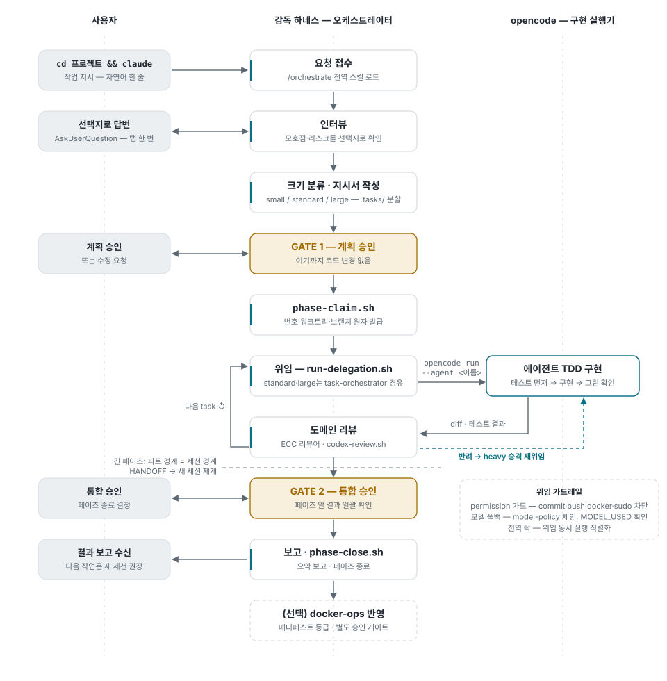
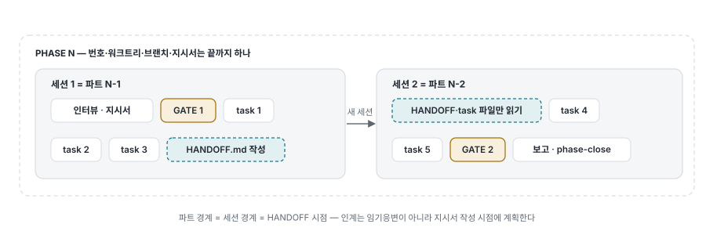
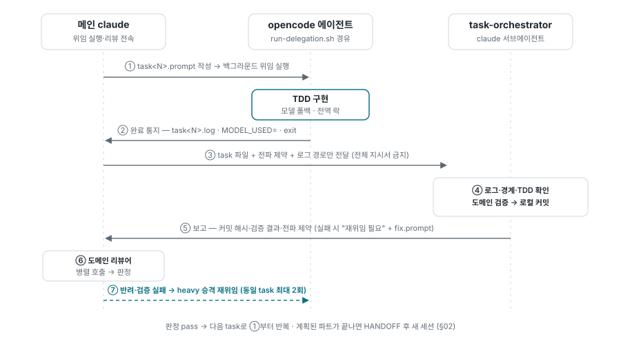
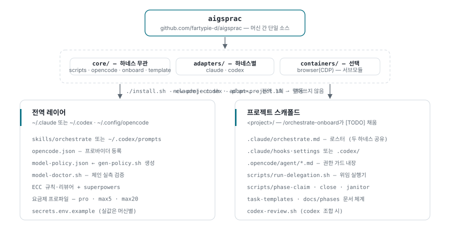
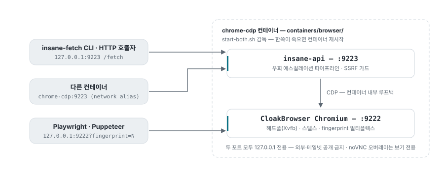

# 오케스트레이션 워크플로우 — 프로젝트에서 감독 하네스를 켜면 일어나는 일

이 킷이 깔린 프로젝트에서 사용자는 **터미널에서 claude(또는 codex)를 실행하고 자연어로 지시**만
한다. 계획·위임·리뷰는 감독 하네스가, 실제 코드 작성은 opencode 에이전트가 맡고, 사용자는 두 번의
승인 게이트에서만 개입한다.

- **역할 분리** — 감독 하네스는 인터뷰·지시서·리뷰만. 구현은 opencode 에이전트가 TDD로 수행한다.
- **게이트 2개** — GATE 1(계획 승인) 전에는 코드가 바뀌지 않고, GATE 2(통합 승인) 없이 페이즈가
  끝나지 않는다.
- **모델 중앙 정책** — 위임 모델은 `model-policy.json` 폴백 체인이 결정 — 한도에 걸리면 자동으로
  다음 모델.

> 라이브 인터랙티브 버전(다이어그램 PNG 내려받기 지원)은 별도 문서로 관리되며, 이 파일은 그
> 내용의 저장소 이식본이다.

## 01 전체 플로우

사용자 관점의 한 사이클(1 페이즈). 왼쪽 레인이 사용자가 실제로 하는 일의 전부다 — 지시 한 줄,
선택지 답변, 승인 두 번. Codex 하네스도 동일한 골격을 따르고, 리뷰 단계만 `codex-review.sh`로
바뀐다.

<picture>
  <source media="(prefers-color-scheme: dark)" srcset="assets/fig-flow-dark.svg">
  
</picture>

1. **요청 접수** — 소스 변경이 필요한 요청이면 전역 `/orchestrate` 스킬이 로드된다. 이후 절차는
   전부 이 스킬이 정의한다.
2. **인터뷰** — 모호점·리스크를 AskUserQuestion 선택지로 묻는다. 무조건 동의하지 않는다 — 더
   단순한 대안이나 기존 구조와의 충돌이 보이면 반론부터 제시한다.
3. **크기 분류 · 지시서** — task를 small/standard/large로 분류하고 지시서를 `.tasks/`로 분할해
   쓴다(장수 세션 컨텍스트 보호).
4. **GATE 1 — 계획 승인** — 사용자가 계획을 승인해야 다음으로 간다. 이 시점까지 코드는 한 줄도
   바뀌지 않는다.
5. **페이즈 클레임** — `bash scripts/phase-claim.sh <slug>`가 flock 원자 처리로 ①레지스트리에서
   번호 발급 ②`git worktree add` ③브랜치 생성을 한 번에 수행하고 `PHASE=/WORKTREE=/BRANCH=`를
   출력한다. 번호는 레지스트리가 유일한 소스 — `ls DOCs/` 육안 선택은 다른 워크트리의 지시서가
   안 보여 중복을 만든다(실측 2건). §03 참조.
6. **위임** — 프롬프트를 `.orchestrate/task<N>.prompt` 파일로 저장하고 `run-delegation.sh`를
   백그라운드로 실행한다(전역 락·모델 폴백·워치독 내장). trivial·small은 메인이 직접 판정하고,
   standard·large는 task-orchestrator 서브에이전트가 로그 확인→검증→로컬 커밋을 전담한다. §04 참조.
7. **도메인 리뷰** — ECC 리뷰어 서브에이전트(Claude) 또는 `codex-review.sh`(Codex)가 diff를
   검수한다. 반려되면 heavy 티어로 승격해 재위임(동일 task 최대 2회). task마다 6↔7을 반복하고,
   계획된 파트가 끝나면 HANDOFF를 쓰고 새 세션으로 넘긴다(§02).
8. **GATE 2 — 통합 승인** — 페이즈 말에 결과를 일괄 확인받는다.
9. **보고 · 정리** — 요약 보고 후 `phase-close.sh`로 페이즈를 닫는다(고아 페이즈는 janitor가
   정리). 컨테이너 반영이 필요하면 docker-ops 절차(매니페스트 등급 + 별도 승인)로 이어진다.

> **오토 모드** — 요청에 "오토" 키워드가 있을 때만 활성화. 질문·게이트를 생략하는 게 아니라
> 정상적으로 띄우고, 120초 무응답이면 첫 번째 "(권장)" 옵션을 자동 채택해 진행한다. 비가역 결과가
> 갈리는 모호점은 자동 채택하지 않고 해당 task를 보류한다.

## 02 세션 단위 — 파트와 HANDOFF

"1페이즈 = 1세션"은 **상한이지 목표가 아니다**. 한 세션에 다 못 끝낼 페이즈는 지시서를 쓰는
시점에 task를 **파트**로 묶어 세션 단위를 미리 계획한다 — 파트 경계 = 세션 경계 = HANDOFF 시점.

<picture>
  <source media="(prefers-color-scheme: dark)" srcset="assets/fig-parts-dark.svg">
  
</picture>

- 파트는 계획·표기 단위일 뿐이다 — 페이즈 번호·워크트리·브랜치는 그대로 하나고, 레지스트리는
  정수 번호만 발급한다. 이어받는 세션은 HANDOFF와 현재 task 파일만 읽고 시작한다(지시서 전체
  재독 금지 — 컨텍스트 보호).
- 계획에 없어도 **스래싱 경고가 뜨거나 한 세션에서 압축이 2회를 넘으면** 진행을 멈추고 즉시
  HANDOFF를 쓴다. 장수 세션의 반복 압축은 요약 품질을 통제할 수 없다.
- HANDOFF.md 내용: 완료 상태표 + 다음 task 번호 + 전파 제약 누적 + 재개 지시 한 줄. 페이즈가
  살아 있는 동안만 유효한 임시 문서라 페이즈 마감 때 삭제된다.
- 세션이 HANDOFF 없이 그냥 끊겨도 다음 세션 시작 시 janitor가 잔재를 정리·보고한다(§03).
- 진행 이벤트(`phase_claimed`·`part_started`·`gate_answered`·`delegation_done`·`task_committed`…)는
  `.orchestrate/events.jsonl`에 append — **usage-dashboard**가 로그 파싱 없이 위임 트리를
  재구성한다.

## 03 페이즈 라이프사이클 — claim · registry · close

페이즈 번호는 사람이 고르지 않는다. 전역 레지스트리(`~/.local/state/orchestrate/`)가 발급하고,
스크립트 두 개가 수명주기를 열고 닫는다. 병렬 세션이 흔한 환경에서 "육안 확인"이 만든 충돌 사고
2건의 재발 방지 장치다.

- **`phase-claim.sh <slug>` — 시작은 원자적으로.** flock으로 번호 발급 + `git worktree add` +
  브랜치 생성을 한 번에 처리하고 `PHASE=/WORKTREE=/BRANCH=`를 출력한다. 이 출력값만 쓴다.
  워크트리 안에서 브랜치를 갈아타지 않는다 — 다른 브랜치가 필요하면 새로 claim한다.
- **워크트리가 격리하는 것은 파일뿐.** opencode 세션 DB·venv·포트는 공유다. 그래서 위임은 전역
  락(`opencode.lock`)이 세션·프로젝트 불문 직렬화한다 — 동시 위임은 실패가 아니라 **대기**
  (최대 30분, LOCK_WAIT 로그)가 된다.
- **지시서는 크기가 통제된다.** `DOCs/PHASE<N>_<slug>.md`. task 3개 이상이면 인덱스(10KB 상한) +
  `.tasks/task<N>.md`로 분할한다 — 단일 거대 지시서는 압축 후 재읽기 루프로 세션을 죽인 실측이
  있다. 인덱스가 상한을 넘으면 페이즈를 쪼개라는 신호다.
- **`phase-close.sh <N>` · janitor — 끝도 원샷.** 워크트리 제거·병합 브랜치 삭제·로그 아카이브·
  레지스트리 항목 제거를 한 번에(선행 조건: 지시서 `status: done`). 여기 못 가고 세션이 끊겨도
  다음 세션의 `orchestrate-janitor.sh`가 안전급 잔재를 정리하고 나머지(dirty 워크트리·미푸시·정체
  PR)를 보고한다.

## 04 위임의 내부 — run-delegation.sh와 task-orchestrator

task 등급이 실행 구조를 가른다. 어느 쪽이든 opencode 호출은 반드시 `run-delegation.sh`를 거친다 —
직접 `opencode run`을 치는 순간 락·폴백·로그 규약이 전부 사라진다.

- **trivial · small — 메인이 직접.** 프롬프트를 `.orchestrate/task<N>.prompt` 파일로 먼저
  저장하고(인용부호 이스케이프 사고 방지) 백그라운드로 실행한다. 완료 후 exit 코드로 판정하고
  검증·커밋도 메인이 수행한다.
- **standard · large — task-orchestrator 경유.** task당 3만~5만 토큰의 위임 로그·왕복이 메인
  컨텍스트에 쌓이는 것을 막는다(46만 토큰 세션 절단 사고의 근본 대응). 단, **위임 실행 자체는
  메인 전속** — 서브에게 맡기면 서브 턴 종료 시 자식 opencode 프로세스가 함께 죽는다. 서브는
  완료된 결과만 다룬다.

<picture>
  <source media="(prefers-color-scheme: dark)" srcset="assets/fig-delegation-dark.svg">
  
</picture>

`run-delegation.sh` 내장: 프리플라이트 · 전역 flock(위임 직렬화) · API 키 자가 주입 · init 워치독 ·
PID 완료 대기 · 모델 폴백 체인 · `MODEL_USED=` 실측 출력. exit 코드가 판정 기준이다. task별 모델
지정은 지시서의 `모델:` 필드를 4번째 인자로 전달 — `heavy` 또는 `provider/model`(실패 시 default
체인 폴백).

## 05 모델은 중앙 정책이 정한다

`~/.config/opencode/model-policy.json`의 tier 체인을 run-delegation.sh가 `-m`으로 주입한다. 이
파일은 **생성물**이다 — 원본은 킷의 `core/opencode/provider-models.json` 매핑표고, `gen-policy.sh`
가 가진 자격증명(구독 OAuth·API 키)을 기준으로 체인을 만들고 `model-doctor.sh`가
`opencode models`로 실측 검증한다 — 오타 난 모델 ID가 조용히 폴백만 소모하는 것을 막는다.

| 티어 | 체인 (예시 — 자격증명에 따라 생성됨) |
|---|---|
| default | `gpt-5.6-luna` → `gemini-3.6-flash-high` → `qwen3.7-plus` → `deepseek-v4-pro` → `deepseek-v4-flash` |
| heavy | `gpt-5.6-terra` → `grok-4.5` → `gemini-3.1-pro-high` → `qwen3.7-max` |

GPT 우선 정책 — 티어 순서는 openai → xai → antigravity → qwen이다. 한도 초과·무응답이면 체인의
다음 모델로 자동 폴백한다. 체인의 각 항목은 서로 다른 할당량 풀(구독 OAuth / API 키 / 프록시)이라
폴백이 실제로 성립한다. 🔴 위험 도메인(실자금 등)·large task·리뷰 반려 재위임은 처음부터 heavy
티어.

## 06 이 플로우를 만드는 킷 — dev-orchestrate-kit v2

위 플로우는 프로젝트마다 손으로 만드는 게 아니라 킷이 스탬프한다. v2는 **core(하네스 무관) +
adapters(하네스별) + containers(선택)** 계층 구조다. 전역은 `./install.sh` 한 번, 프로젝트는
신규면 `new-project.sh`, 기존 프로젝트면 `adopt-project.sh`(비파괴 — 기존 파일을 절대 덮지
않는다). 마지막으로 프로젝트에서 `/orchestrate-onboard`가 스택을 실측 감지해 로스터·위임
에이전트·리뷰어 매핑을 채운다.

<picture>
  <source media="(prefers-color-scheme: dark)" srcset="assets/fig-kit-dark.svg">
  
</picture>

런타임에는 전역 /orchestrate 스킬이 프로젝트의 로스터·스크립트를 참조해 플로우를 구동한다 —
절차는 전역에 한 벌, 프로젝트별 차이는 로스터에만 담긴다. 하네스가 바뀌어도 core는 그대로고
adapters만 갈아 끼운다.

- **요금제별 토큰 프로파일** — `--plan=pro|max5|max20`이 Claude 요금제에 맞춰 서브에이전트 모델을
  배정한다. 절약은 worker 클래스와 사고 예산에서 하고, 품질 게이트(리뷰어)는 어느 요금제에서도
  sonnet을 유지한다.
- **usage-dashboard — 관측 컴포넌트** — Claude Code·opencode 세션 사용량을 분석하는 로컬 웹
  대시보드(`127.0.0.1:9280`, Docker). 킷에 git submodule로 포함되어 `.orchestrate/events.jsonl`과
  세션 로그를 읽어 모델 믹스·비용·캐시 효율·위임 체인·세션 건강도를 보여준다. 개발은 독립
  저장소에서 계속되고, 킷은 릴리스 시점의 포인터만 갱신한다.

## 07 공유 브라우저 컨테이너 — CloakBrowser + insane

워크플로우와 별개로 호스트의 모든 사용자·도구가 쓰는 웹 접근 인프라. 컨테이너 하나가 포트 두
개를 서빙한다 — X 디스플레이·GPU·특수 권한 없이 동작한다(브라우저는 컨테이너 내부 Xvfb에서
헤드풀로 뜬다). v2부터 킷의 `containers/browser/`에 번들되어(엔진 소스 vendored) 어느 머신에서든
`docker compose up`으로 재현된다. 오케스트레이션과 독립적으로도 쓸 수 있다.

<picture>
  <source media="(prefers-color-scheme: dark)" srcset="assets/fig-browser-dark.svg">
  
</picture>

- **insane-fetch — 가장 쉬운 경로.** `insane-fetch <url> -s '<selector>'` — selector는 필수에
  가깝다: 엔진이 진짜 페이지와 WAF 챌린지 페이지를 구분하는 근거다. exit 0 성공 / 1 전 경로 실패
  / 2 사용 오류.
- **HTTP API — 스크립트·에이전트용.** `GET·POST /fetch`(url·selectors·device), `GET /usage`,
  `GET /health`. 응답에 `verdict`(strong_ok/weak_ok/challenge…)와 시도별 `trace[]`가 담긴다.
- **Raw CDP — 자체 자동화용.** `connect_over_cdp("http://127.0.0.1:9222")`. `?fingerprint=N`마다
  독립 브라우저 신원 + 전용 프로필이 생기고 재접속에도 세션이 유지된다(단 idle 1800초면 프로필째
  소멸).
- **에스컬레이션 파이프라인.** 가벼운 curl 계열 전송부터 시작해 실패 verdict마다 브라우저
  실행기까지 단계적으로 올라간다 — 시도 전체가 `trace[]`로 남는다.

> **보안 경계 — 바꾸면 안 되는 것들.** CDP는 무인증이다 — 9222에 닿는 누구든 로컬 파일을 읽고
> 임의 JS를 실행할 수 있다. 두 포트 모두 `127.0.0.1` 바인딩이 유일한 방어선이므로
> `0.0.0.0`·테일넷·터널 공개 금지. insane-api는 사설·루프백·클라우드 메타데이터 대상을
> `403 blocked target`으로 거부하며, 이 가드는 요청 파라미터로 끌 수 없다. 가져온 페이지 내용은
> 공격자 통제 데이터다 — LLM에 넣을 때는 `--wrap`으로 비신뢰 컨텐츠 봉투와
> `prompt_injection_risk` 판정을 함께 받을 것.

## 08 지켜지는 규약

- **로스터 없이 위임 금지** — `.claude/orchestrate.md`가 에이전트·리뷰어 매핑·검증 명령의 단일
  소스다. 로스터에 없는 에이전트로는 위임하지 않는다.
- **감독관은 소스에 손대지 않는다** — 감독 하네스가 직접 수정할 수 있는 것은 `DOCs/` 문서와
  `.claude/` 설정뿐. 나머지는 전부 위임이다.
- **위험한 일은 기계가 막는다** — opencode 에이전트의 `permission` frontmatter가 git
  commit·push, docker 조작, sudo, `rm -rf`를 차단한다. 커밋 권한은 게이트를 통과한 절차에만 있다.
- **개선은 킷으로 흐른다** — 스킬·스크립트를 어느 머신에서 고치든 킷에 반영 → push → 다른
  머신에서 `./install.sh` 재실행(멱등). 로컬만 고치면 다음 설치 때 되돌아간다. 예외: 컨테이너는
  개발 호스트가, model-policy는 매핑표가 원본이다.

---

근거 문서: [README.ko.md](../README.ko.md) · [PORTING.md](./PORTING.md) ·
[specs/2026-08-07-kit-v2-adapters-design.md](./specs/2026-08-07-kit-v2-adapters-design.md) ·
`containers/browser/README.md` ·
[usage-dashboard](https://github.com/fartypie-d/usage-dashboard)
