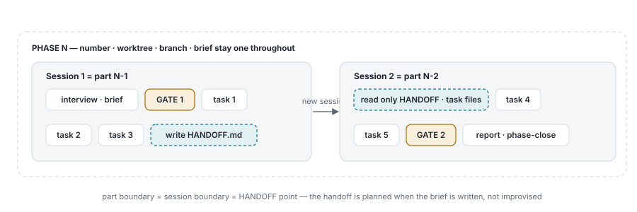
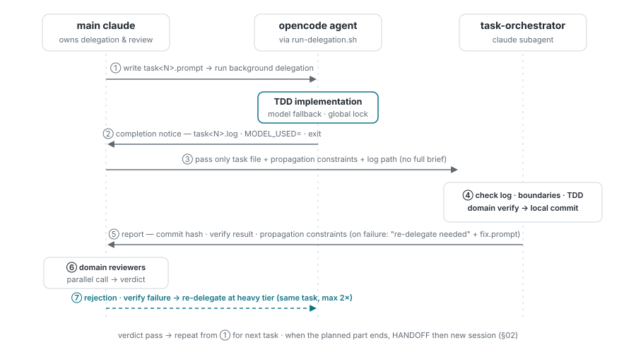
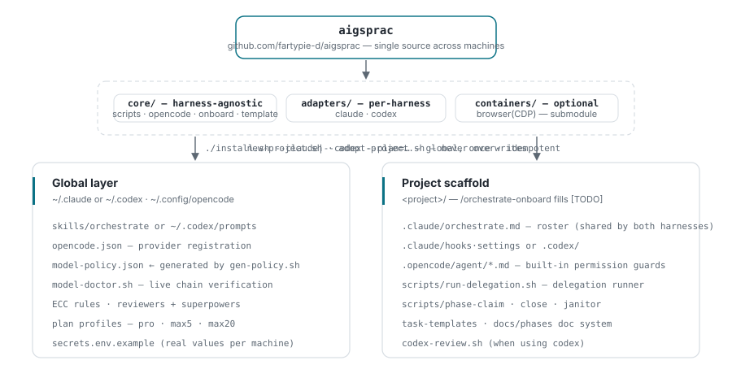
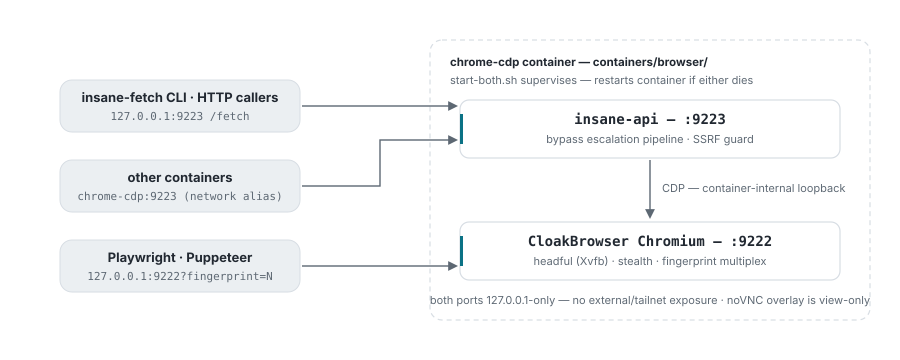

# Orchestration workflow — what happens when you turn the supervisor harness on

In a project where this kit is installed, the user only **runs claude (or codex) in the
terminal and gives instructions in natural language**. The supervisor harness handles
planning, delegation, and review; opencode agents do the actual coding; and the user steps
in only at two approval gates.

- **Role separation** — the supervisor harness does interviews, briefs, and reviews only.
  Implementation is done by opencode agents via TDD.
- **Two gates** — no code changes before GATE 1 (plan approval), and no phase ends without
  GATE 2 (integration approval).
- **Central model policy** — the delegation model is decided by the `model-policy.json`
  fallback chain; when a limit is hit it automatically moves to the next model.

> A live interactive version (with diagram PNG downloads) is maintained as a separate
> document; this file is the in-repo port of that content.

## 01 Full flow

One cycle from the user's point of view (one phase). The left lane is everything the user
actually does — one line of instruction, a few choice answers, two approvals. The Codex
harness follows the same skeleton, with only the review step swapped for `codex-review.sh`.

<picture>
  <source media="(prefers-color-scheme: dark)" srcset="assets/fig-flow-en-dark.svg">
  
</picture>

1. **Receive request** — if the request needs a source change, the global `/orchestrate`
   skill is loaded. Everything that follows is defined by that skill.
2. **Interview** — ambiguities and risks are asked as AskUserQuestion choices. It does not
   agree unconditionally — if a simpler alternative or a conflict with the existing structure
   is visible, it pushes back first.
3. **Size classification · brief** — the task is classified as small/standard/large and the
   brief is split into `.tasks/` (protecting long-session context).
4. **GATE 1 — plan approval** — the user must approve the plan before moving on. Up to this
   point not a single line of code has changed.
5. **Phase claim** — `bash scripts/phase-claim.sh <slug>` does, atomically under flock,
   ① issue a number from the registry, ② `git worktree add`, and ③ create the branch in one
   shot, printing `PHASE=/WORKTREE=/BRANCH=`. The registry is the sole source of the number —
   eyeballing `ls DOCs/` can't see briefs in other worktrees and creates duplicates (2
   observed incidents). See §03.
6. **Delegation** — the prompt is saved to a `.orchestrate/task<N>.prompt` file and
   `run-delegation.sh` is run in the background (global lock, model fallback, watchdog
   built in). trivial·small are judged directly by main; standard·large are handled by the
   task-orchestrator subagent, which owns log check → verification → local commit. See §04.
7. **Domain review** — an ECC reviewer subagent (Claude) or `codex-review.sh` (Codex)
   reviews the diff. On rejection it is promoted to the heavy tier and re-delegated (same
   task, max 2×). Steps 6↔7 repeat per task; when the planned part ends, a HANDOFF is written
   and the work moves to a new session (§02).
8. **GATE 2 — integration approval** — results are batch-reviewed at the end of the phase.
9. **Report · cleanup** — after a summary report, the phase is closed with `phase-close.sh`
   (orphaned phases are cleaned up by the janitor). If container changes are needed, it
   continues to the docker-ops procedure (manifest tier + separate approval).

> **Auto mode** — activated only when the request contains the "auto" keyword. It does not
> skip questions or gates; it raises them normally, and after 120 seconds of no response it
> auto-adopts the first "(recommended)" option and proceeds. Ambiguities where an
> irreversible outcome is at stake are not auto-adopted — that task is held instead.

## 02 The session unit — parts and HANDOFF

"One phase = one session" is an **upper bound, not a goal**. A phase that won't fit in one
session groups its tasks into **parts** at brief-writing time, planning the session
boundaries in advance — part boundary = session boundary = HANDOFF point.

<picture>
  <source media="(prefers-color-scheme: dark)" srcset="assets/fig-parts-en-dark.svg">
  
</picture>

- A part is only a planning/labeling unit — the phase number, worktree, and branch stay as
  one, and the registry issues only integer numbers. The resuming session starts by reading
  only the HANDOFF and the current task files (no re-reading the whole brief — context
  protection).
- Even if it isn't in the plan, when a **thrashing warning appears or compaction happens more
  than twice in one session**, work stops and a HANDOFF is written immediately. Repeated
  compaction in long sessions makes summary quality uncontrollable.
- HANDOFF.md contents: a completion status table + the next task number + accumulated
  propagation constraints + a one-line resume instruction. It is a temporary document valid
  only while the phase is alive, so it is deleted at phase close.
- Even if a session just dies without a HANDOFF, the janitor cleans up and reports the
  remnants at the start of the next session (§03).
- Progress events (`phase_claimed`·`part_started`·`gate_answered`·`delegation_done`·
  `task_committed`…) are appended to `.orchestrate/events.jsonl` — **usage-dashboard**
  reconstructs the delegation tree without log parsing.

## 03 Phase lifecycle — claim · registry · close

Phase numbers are not chosen by a human. A global registry
(`~/.local/state/orchestrate/`) issues them, and two scripts open and close the lifecycle.
This is the safeguard against 2 collision incidents caused by "eyeballing" in an environment
where parallel sessions are common.

- **`phase-claim.sh <slug>` — start atomically.** Under flock it does number issuance +
  `git worktree add` + branch creation in one shot and prints `PHASE=/WORKTREE=/BRANCH=`. Use
  only that output. Don't switch branches inside a worktree — if you need a different branch,
  claim a new one.
- **A worktree isolates only files.** The opencode session DB, venv, and ports are shared.
  So delegation is serialized by a global lock (`opencode.lock`) regardless of session or
  project — concurrent delegation is not a failure but a **wait** (up to 30 min, LOCK_WAIT
  log).
- **Briefs are size-controlled.** `DOCs/PHASE<N>_<slug>.md`. With 3+ tasks it is split into
  an index (10KB cap) + `.tasks/task<N>.md` — a single giant brief has been observed killing
  a session with the compact-then-reread loop. When the index exceeds the cap, that's a
  signal to split the phase.
- **`phase-close.sh <N>` · janitor — one-shot ending too.** Worktree removal, merged-branch
  deletion, log archiving, and registry-entry removal in one go (precondition: brief
  `status: done`). Even if a session dies before reaching here, the next session's
  `orchestrate-janitor.sh` cleans up safe-grade remnants and reports the rest (dirty
  worktrees, unpushed work, stale PRs).

## 04 Inside delegation — run-delegation.sh and task-orchestrator

The task tier splits the execution structure. Either way, opencode calls must go through
`run-delegation.sh` — the moment you type `opencode run` directly, the lock, fallback, and
log conventions all disappear.

- **trivial · small — main does it directly.** The prompt is first saved to a
  `.orchestrate/task<N>.prompt` file (to prevent quote-escaping accidents) and run in the
  background. On completion main judges by exit code and does verification and commit too.
- **standard · large — via task-orchestrator.** This keeps the 30k–50k tokens of delegation
  logs and round-trips per task from piling up in main's context (the root fix for the
  460k-token session-truncation incident). However, **running the delegation itself is
  main's exclusive job** — if handed to a sub, the child opencode process dies when the sub's
  turn ends. The sub handles only completed results.

<picture>
  <source media="(prefers-color-scheme: dark)" srcset="assets/fig-delegation-en-dark.svg">
  
</picture>

`run-delegation.sh` built-ins: preflight · global flock (delegation serialization) · API-key
self-injection · init watchdog · PID completion wait · model fallback chain · `MODEL_USED=`
live output. The exit code is the judgment criterion. Per-task model selection is passed as
the 4th argument from the brief's `model:` field — `heavy` or `provider/model` (falls back to
the default chain on failure).

## 05 The model is decided by central policy

run-delegation.sh injects the tier chain from `~/.config/opencode/model-policy.json` via
`-m`. This file is a **generated artifact** — the source of truth is the kit's
`core/opencode/provider-models.json` mapping table, `gen-policy.sh` builds the chain from the
credentials on hand (subscription OAuth · API keys), and `model-doctor.sh` verifies it live
with `opencode models` — preventing a typo'd model ID from silently burning fallbacks.

| Tier | Chain (example — generated from credentials) |
|---|---|
| default | `gpt-5.6-luna` → `gemini-3.6-flash-high` → `qwen3.7-plus` → `deepseek-v4-pro` → `deepseek-v4-flash` |
| heavy | `gpt-5.6-terra` → `grok-4.5` → `gemini-3.1-pro-high` → `qwen3.7-max` |

GPT-first policy — the tier order is openai → xai → antigravity → qwen. On limit-exceeded or
no-response it auto-falls back to the next model in the chain. Each chain entry is a different
quota pool (subscription OAuth / API key / proxy), so the fallback actually holds. 🔴
High-risk domains (real money, etc.), large tasks, and review-rejection re-delegation start
at the heavy tier from the outset.

## 06 The kit that builds this flow — dev-orchestrate-kit v2

The flow above isn't hand-built per project — the kit stamps it. v2 is a layered structure of
**core (harness-agnostic) + adapters (per-harness) + containers (optional)**. Global is
`./install.sh` once; the project is `new-project.sh` if new, or `adopt-project.sh` for an
existing project (non-destructive — it never overwrites existing files). Finally, in the
project `/orchestrate-onboard` detects the stack live and fills in the roster, delegation
agents, and reviewer mapping.

<picture>
  <source media="(prefers-color-scheme: dark)" srcset="assets/fig-kit-en-dark.svg">
  
</picture>

At runtime the global /orchestrate skill drives the flow by referencing the project's roster
and scripts — the procedure lives once globally, and per-project differences live only in the
roster. When the harness changes, core stays and only adapters are swapped.

- **Plan-based token profiles** — `--plan=pro|max5|max20` assigns subagent models to match
  the Claude plan. Savings come from the worker class and thinking budget, and the quality
  gate (reviewer) keeps sonnet on every plan.
- **usage-dashboard — the observability component** — a local web dashboard
  (`127.0.0.1:9280`, Docker) that analyzes Claude Code and opencode session usage. Included in
  the kit as a git submodule, it reads `.orchestrate/events.jsonl` and session logs to show
  model mix, cost, cache efficiency, delegation chains, and session health. Development
  continues in its own repo; the kit only bumps the pointer at release time.

## 07 Shared browser container — CloakBrowser + insane

Separate from the workflow, this is the web-access infrastructure used by every user and tool
on the host. One container serves two ports — it works without an X display, GPU, or special
privileges (the browser runs headful on the container's own Xvfb). It is developed in its own
repository, [insane-cloak](https://github.com/fartypie-d/insane-cloak), and referenced here as
the `containers/browser` submodule — run `git submodule update --init containers/browser`, then
`docker compose up` reproduces it on any machine. It can also be used independently of
orchestration.

<picture>
  <source media="(prefers-color-scheme: dark)" srcset="assets/fig-browser-en-dark.svg">
  
</picture>

- **insane-fetch — the easiest path.** `insane-fetch <url> -s '<selector>'` — the selector is
  nearly mandatory: it's how the engine distinguishes a real page from a WAF challenge page.
  exit 0 success / 1 all paths failed / 2 usage error.
- **HTTP API — for scripts and agents.** `GET·POST /fetch` (url·selectors·device),
  `GET /usage`, `GET /health`. The response carries a `verdict`
  (strong_ok/weak_ok/challenge…) and a per-attempt `trace[]`.
- **Raw CDP — for your own automation.** `connect_over_cdp("http://127.0.0.1:9222")`. Each
  `?fingerprint=N` gets an independent browser identity + dedicated profile, and the session
  survives reconnection (but the profile is destroyed after 1800s idle).
- **Escalation pipeline.** It starts from lightweight curl-family transports and climbs step
  by step to the browser runner on each failing verdict — the whole attempt is recorded in
  `trace[]`.

> **Security boundary — the things you must not change.** CDP is unauthenticated — anyone who
> can reach 9222 can read local files and run arbitrary JS. The `127.0.0.1` binding on both
> ports is the only line of defense, so no `0.0.0.0`, tailnet, or tunnel exposure. insane-api
> rejects private, loopback, and cloud-metadata targets with `403 blocked target`, and this
> guard cannot be turned off via a request parameter. Fetched page content is
> attacker-controlled data — when feeding it to an LLM, use `--wrap` to also get the
> untrusted-content envelope and the `prompt_injection_risk` verdict.

## 08 The conventions that are enforced

- **No delegation without a roster** — `.claude/orchestrate.md` is the single source for
  agent/reviewer mapping and verification commands. Don't delegate to an agent not in the
  roster.
- **The supervisor doesn't touch source** — the only things the supervisor harness may edit
  directly are `DOCs/` documents and `.claude/` config. Everything else is delegated.
- **Machines block the dangerous stuff** — the opencode agents' `permission` frontmatter
  blocks git commit·push, docker operations, sudo, and `rm -rf`. Commit rights exist only for
  a procedure that has passed the gates.
- **Improvements flow into the kit** — wherever you fix a skill or script, reflect it in the
  kit → push → re-run `./install.sh` on other machines (idempotent). Fixing only locally gets
  reverted at the next install. Exceptions: the container's source of truth is the dev host,
  and model-policy's is the mapping table.

---

Source documents: [README.md](../README.md) · [PORTING.md](./PORTING.md) ·
[specs/2026-08-07-kit-v2-adapters-design.md](./specs/2026-08-07-kit-v2-adapters-design.md) ·
`containers/browser/README.md` ·
[usage-dashboard](https://github.com/fartypie-d/usage-dashboard)
